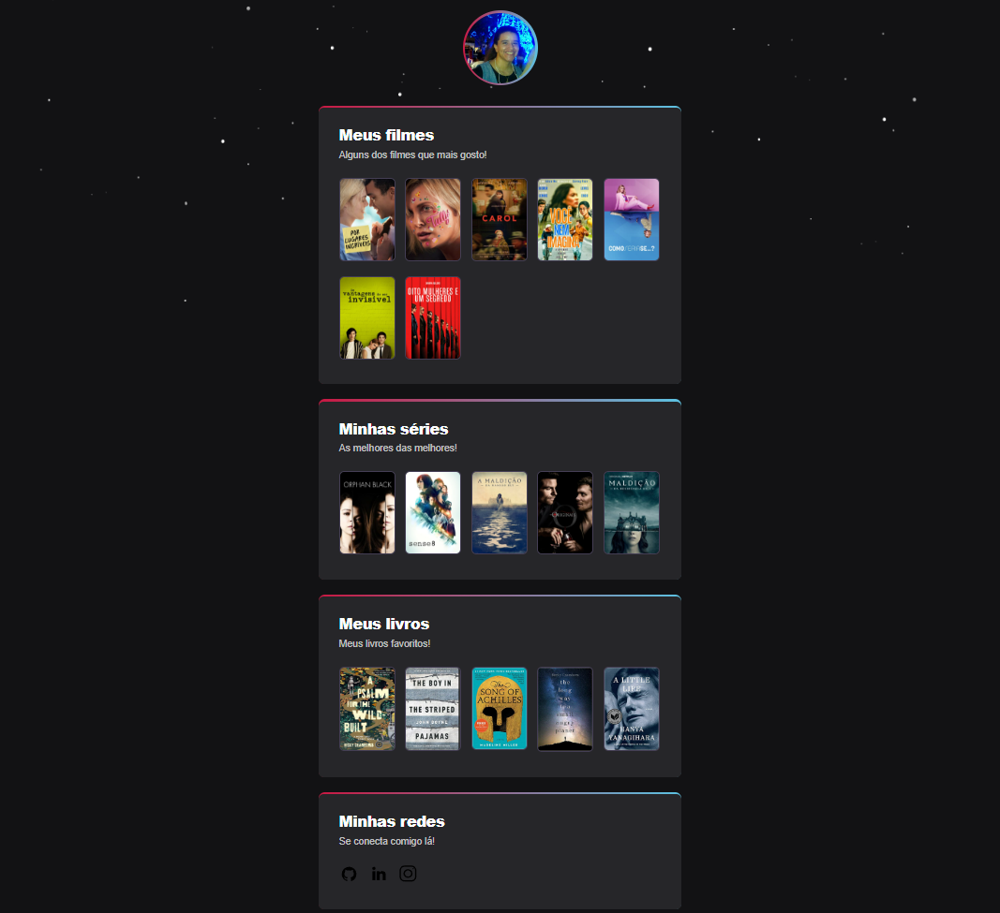

# NLW eSports - Desafio

> > ## eFavs

> Trilha Explorer

Projeto desafio proposto ao final da última aula prática pelo professor Mayk Brito. A proposta era realizar diversas alterações, baseadas em um design disponibilizado, no projeto principal feito durante a semana e transformá-lo para outro tema.

> 🔗 [Você pode clicar aqui para ver o projeto](https://e-favs.vercel.app/)

## 🛠 Tecnologias

- HTML
- CSS
- Git e GitHub

## 👋🏼 Contatos

- marianectrodrigues@gmail.com
- https://www.linkedin.com/in/marianectrodrigues/
